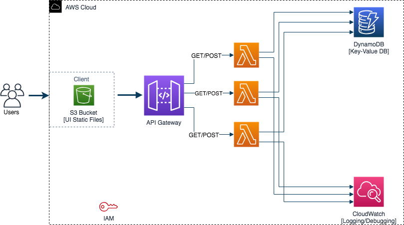

# Serverless Architecture

This project demonstrates the implementation of an application using a
serverless architecture by making use of various AWS services.

## The architecture

## Service elements 
S3 Bucket: Used to store the user interface static files and an
endpoint to the file is used to access the front end.
`http://dm240bucket.s3-website-us-east-1.amazonaws.com/`

API Gateway: Primarily used to create, publish, monitor, and secure
the APIs. Lambda functions are mapped to respective api endpoints
available in the API Gateway. The base API URL is of the form:
`https://{restapi_id}.execute-api.{region}.amazonaws.com/{stage_name}/`. A
resource endpoint is then appended to this base URL.

Lambda Functions: These allow the running of code without the need to
deploy servers. The service charges for compute time per 100ms of
function run-time.

DynamoDB: A Key-Value storage solution that is used to store the
application's data

CloudWatch: A monitoring and management system which is used to log
various service activity. In this setup it provides handy debugging
channel for lambda functions.

All of these applications have in built scalability
Since this project is currently ongoing updates will follow as the
project progresses.
